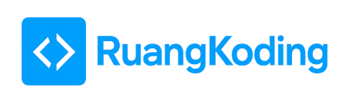

# RuangKoding



**RuangKoding** adalah platform komunitas dan pembelajaran pemrograman yang menggabungkan diskusi, praktik langsung, serta bantuan AI secara interaktif.  
Proyek ini dirancang untuk mendorong pemahaman konsep, bukan sekadar menyalin jawaban.

---

## ✨ Fitur Utama

### 1. QnA (Question & Answer)
Fitur tanya jawab antar pengguna untuk mendiskusikan permasalahan pemrograman dan berbagi solusi berbasis komunitas.

### 2. Lautan Feedback
Pengguna dapat membagikan proyek mereka dan mendapatkan feedback instan, baik dari AI maupun komunitas.  
Fitur ini berfokus pada feedback yang konstruktif dan aplikatif.

### 3. Explain Your Code
Pengguna meminta AI untuk menjelaskan kode mereka dengan alur sebagai berikut:
- Pengguna mengirimkan kode
- AI mengajukan beberapa pertanyaan
- Pengguna menjawab untuk mengukur pemahaman
- AI menjelaskan kode secara bertahap  

Tujuan fitur ini adalah melatih refleksi dan pemahaman, bukan ketergantungan pada AI.

### 4. Daily Code Challenge
Setiap hari, pengguna akan mendapatkan tantangan coding sederhana–menengah yang dihasilkan oleh AI.  
Pengguna dapat langsung menulis dan mengirimkan solusi mereka melalui website.

---

## 🛠️ Tech Stack

- **Frontend & Backend**: Next.js
- **Database & Auth**: Supabase
- **AI Integration**: API-based
- **Deployment**: Docker

> **Catatan:**  
> Proyek ini menggunakan Node.js untuk menjalankan Next.js, namun pengguna **tidak perlu memahami npm secara mendalam** untuk sekadar menjalankan aplikasi.

---

## 🚀 Cara Instalasi & Menjalankan Proyek

Tersedia **dua metode instalasi**:

1. Instalasi Manual (Clone Repository)
2. Instalasi Menggunakan Docker (**Sangat Direkomendasikan**)

---

## 🔧 Opsi 1: Instalasi Manual (Clone GitHub)

### 1. Clone Repository
```bash
git clone https://github.com/username/ruang-koding.git
cd ruang-koding
```
### 2. Install Dependency

Pastikan Node.js sudah terinstall.
```bash
npm install
```
### 3. Konfigurasi Environment
Rename file environment berikut:
```bash
mv .env.local.example .env.local
```
### 4. Jalankan Aplikasi
```bash
npm run dev
```
Aplikasi akan berjalan secara lokal dan dapat diakses melalui browser.

## 🐳 Opsi 2: Instalasi Menggunakan Docker (Sangat Direkomendasikan)
Metode ini paling stabil dan paling sederhana.

### 1. Install Docker Desktop
Silakan install Docker Desktop sesuai sistem operasi:
- Windows
- macOS
- Linux
Pastikan Docker sudah berjalan sebelum melanjutkan.
### 2. Pull Image Docker
```bash
docker pull j0pyter/ruang-koding:latest
```
### 3. Jalankan Container
```bash
docker run -p 3000:3000 j0pyter/ruang-koding:latest
```
Setelah container berjalan, aplikasi dapat diakses melalui browser.
> **Catatan:**  
> Pada metode Docker, seluruh dependency dan konfigurasi dasar telah disiapkan di dalam image, sehingga tidak perlu melakukan instalasi npm atau konfigurasi environment secara manual.

--- 

## 📌 Rekomendasi
Untuk:
- Keperluan demo
- Penilaian juri
- Menghindari konflik dependency

➡️ Gunakan metode Docker.

---

## 📄 Lisensi
Proyek ini dikembangkan untuk keperluan pembelajaran dan kompetisi.
Detail lisensi dapat disesuaikan sesuai kebutuhan.

--- 

##🗄️ Supabase Database Schema (Ringkasan)
RuangKoding menggunakan Supabase sebagai backend utama untuk autentikasi, penyimpanan data, dan relasi antar fitur.
Struktur database dirancang modular untuk mendukung fitur komunitas, feedback proyek, AI assistance, dan gamifikasi.

### 👤 User & Profile
```auth.users``` (Supabase Auth)
Digunakan untuk autentikasi pengguna.

```profiles```
Menyimpan data publik pengguna dan terhubung langsung ke auth.users.
Digunakan untuk:
- Identitas user (nama, bio, foto)
- Sistem level dan XP
- Informasi profil komunitas

Tabel pendukung profil:
- ```user_links``` – tautan sosial pengguna
- ```user_skills``` – skill dan level keahlian
- ```user_experience``` – pengalaman kerja/proyek
- ```user_auth_limit``` – pembatasan autentikasi
- ```xp_events``` – histori perolehan XP dan aktivitas
---
### ❓ QnA System
```questions```
- Menyimpan pertanyaan pengguna dalam sistem QnA.
- Mendukung accepted answer
- Memiliki view counter dan status closed

```answers```
Jawaban terhadap pertanyaan.
- Mendukung penandaan jawaban paling membantu
Interaksi tambahan:
- ```quest_vote```, ```answ_vote``` – sistem voting
- ```quest_comment```, ```answ_comment``` – komentar & balasan
- ```saved_quest``` – simpan pertanyaan
- ```quest_tags```, ```tags``` – sistem tagging
---
### 🌊 Lautan Feedback (Project Feedback)
```request_feedback```
Permintaan feedback proyek dari pengguna.
- Menyimpan URL proyek dan deskripsi
- Bisa diberi tag dan vote

```feedback```
Isi feedback terhadap suatu request.
- Disimpan dalam format JSON untuk fleksibilitas
Interaksi lanjutan:
- ```feedback_vote``` – vote feedback
- ```feedback_comment``` – komentar & balasan
- ```saved_req``` – simpan request feedback
- ```request_vote```, ```request_tags``` – voting & tagging
---
### 🤖 Explain Your Code (AI-Assisted)
```code_explain_request```
Permintaan pengguna untuk penjelasan kode oleh AI.

```code_ai_question```
Pertanyaan yang diajukan AI untuk mengukur pemahaman pengguna sebelum penjelasan.

```code_ai_review```
Hasil akhir analisis AI, berisi:
- Penjelasan kode
- Tips perbaikan
- Kesimpulan
--- 
### 🧩 Daily Code Challenge
```daily_code_challenge```
Tantangan coding harian yang di-generate oleh AI.

```daily_code_user```
Jawaban pengguna terhadap tantangan harian.
- Menyimpan solusi
- Status benar/salah
- Penjelasan tambahan
---
### 🔔 Notifications & Interactions
```notifications```
Sistem notifikasi internal untuk:
- Vote
- Komentar

```comment_likes```
Like untuk komentar di berbagai fitur (QnA & Feedback).

---
### 📌 Catatan Desain
- Seluruh relasi user terpusat pada tabel profiles
- Struktur komentar mendukung nested replies
- Voting dirancang terpisah untuk fleksibilitas
- Data AI disimpan terpisah dari data user untuk menjaga kejelasan alur
- Skema mendukung skalabilitas dan pengembangan fitur lanjutan
  
---

## 👤 Penutup
RuangKoding bertujuan membangun ekosistem belajar pemrograman yang aktif, reflektif, dan berkelanjutan.
Belajar coding bukan hanya tentang jawaban yang benar, tapi tentang memahami prosesnya.
